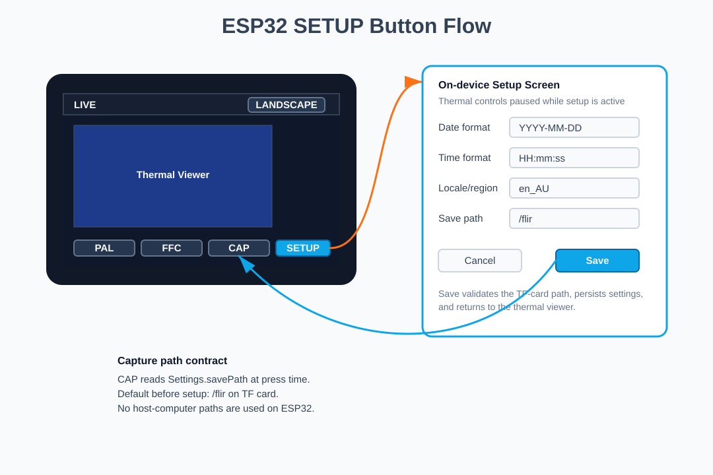

# FLIR App Design

This document describes the implemented design for the Waveshare
ESP32-S3-Touch-LCD-3.5B FLIR application. The firmware initializes the built-in
LCD/touch/TF-card paths, reads real FLIR Lepton VoSPI frames, renders the live
thermal UI, and saves annotated captures to the onboard TF card.

## Expected Runtime UI

### Landscape Default


### Portrait Optional


The first complete app screen should prioritize a live thermal viewport with
only the controls and readouts needed during use: frame status, hot/cold markers,
center temperature, palette/range state, manual FFC, QMI8658-driven
auto-rotation, zoom, capture to TF card, and `SETUP` configuration.

Landscape is the default orientation for this hardware. The Type B board has an
onboard QMI8658 6-axis IMU on the internal I2C bus. The firmware reads the raw
accelerometer gravity vector and auto-rotates between landscape and portrait
after a sustained 500 ms physical orientation change. The status bar should
place the active orientation icon at the left edge of the screen, followed by a
zoom toggle, a hot/cold annotation toggle, and a center annotation toggle. The
orientation icon uses a wide display glyph in landscape and a tall display glyph
in portrait, but it is not a touch button. The zoom toggle is icon-only and has
no visible button background; zoom mode renders a center crop of the Lepton
frame and remaps hot/cold marker positions to the visible crop. The hot/cold
toggle controls only the square hot/cold markers and their labels on the live
thermal viewport and captured BMP. The center toggle controls only the center
plus marker and center temperature label on the live viewport and captured BMP.
Palette-scale temperatures and the readout panel are always shown and are not
affected by these annotation toggles. The selected orientation should be saved
with other viewer settings so the device boots back into the user's last chosen
layout.
Portrait mode keeps the palette scale and its high/low temperature labels in a
narrow strip beside the thermal viewport, matching the landscape diagram. It
does not use the older wide right-side readout column, so most of the portrait
screen remains available for the FLIR image.

The final render target is the built-in 480x320 landscape display using the
panel's driver-native pixel path. Keep palette calculations internally high
precision, then let `display_driver` pack to the active AXS15231B QSPI format.
For this board, RGB565 is the first implementation target unless the selected
AXS15231B QSPI driver explicitly supports RGB666/262K frame pushes. See
[Display Driver Design](display-driver-design.md).

The `FFC` button triggers FLIR flat-field correction. FFC lets the Lepton
recalibrate its sensor offset against a uniform reference, usually the module's
internal shutter, which reduces fixed-pattern noise, image banding, and thermal
drift after warm-up or ambient temperature changes.

The `PAL` button cycles thermal visualization styles: Ironbow, White Hot, Black
Hot, and Histogram. Histogram mode should use the frame distribution to improve
contrast when the scene has a narrow temperature range.

The `SETUP` button opens an on-device ESP32 setup screen or overlay. See
[ESP32 Setup Button Design](esp32-setup-button-design.md) for the embedded C++
settings, validation, persistence, and capture-path contract.
The main runtime controls should use compact functional icons instead of text:
palette swatches for `PAL`, shutter bars for `FFC`, a camera outline for `CAP`,
a playback/review icon for the latest capture, and a gear-like settings mark
for `SETUP`. The capture-review control opens a small modal-style review panel
showing the latest saved capture path with `Delete` and `Close` actions. Delete
removes the saved BMP and matching optional raw file pair.



The setup screen includes an `Idle` field for touch-based inactivity sleep. The
field is expressed in seconds and cycles through `Off`, `30`, `60`, `120`,
`300`, and `600` seconds. When enabled, firmware sleeps the Lepton through the
backend CCI power-management path after the timeout expires. A first touch while
asleep wakes the Lepton and is consumed by the wake action.
Automatic idle sleep also turns off the LCD backlight after writing the bottom
status message. Touch wake and Serial `wake` turn the backlight on before
recovering the Lepton. Manual Serial `sleep` leaves the screen on for
diagnostics.
The setup screen also includes a `Cal` temperature offset field. It cycles in
`0.5C` steps from `-5.0C` through `+5.0C`, persists in NVS, and is applied only
to displayed temperature labels. Raw thermal data and saved `.raw` frames remain
uncorrected.
The setup screen includes an `Auto` rotation toggle. When enabled, QMI8658
gravity-vector auto-rotation selects landscape or portrait. When disabled, the
`Orientation` setting manually selects `Landscape` or `Portrait` and the display
and touch mapping are reindexed when setup is saved.
The setup screen includes a `Show Filename` toggle for captured BMP images.
Captured BMP annotation content follows the runtime status-bar annotation
toggles: high/low enabled records `HIGH` and `LOW`, and center enabled records
`CTR`. When both annotation toggles are off, the temperature footer is omitted
unless `Show Filename` is enabled. When `Show Filename` is enabled, the footer
also includes the saved BMP filename.
The setup screen includes a `Raw` switch. Green/right means raw saving is
enabled; gray/left means the capture button saves only the annotated BMP. The
annotated BMP is always saved.
The setup screen should remain scrollable as fields are added. The current
firmware renders scroll affordances in portrait setup so future options can
extend below the visible panel without covering Save/Cancel.
Runtime feedback is shown on the last line of the screen. This bottom status
line reports button actions, capture results, idle timeout sleep, and Lepton
wake progress without covering the thermal viewport or the main controls.

When `CAP` is pressed, capture storage must use the active save path from the
runtime configuration last saved through `SETUP`. The capture module should read
that setting at capture time instead of caching a separate path, so setup changes
apply immediately.

## System Architecture Overview

The full firmware should be split into shared board support and real FLIR code:

- `include/pin_config.h`: board pin assignments for LCD, touch, SD, and FLIR.
- `include/board/` and `src/board/`: Waveshare display, touch, TF-card, and
  backlight configuration. For this 3.5B board, use the AXS15231B QSPI display
  path defined in [Waveshare 3.5B Board Profile](waveshare-35b-board-profile.md)
  and [Display Driver Design](display-driver-design.md).
- `src/flir/`: real Lepton acquisition, image processing, rendering, touch capture, and SD saving.
- `src/main.cpp`: initializes board support and runs the FLIR application loop.

Follow [Modular Design Principles](modular-design-principles.md): keep
`src/main.cpp` thin, route all lifecycle orchestration through `Application`, and
add future devices as independent driver modules with explicit interfaces.

The LCD, touch controller, backlight, and TF card are built into the Waveshare
board. The firmware should use the 3.5B board support definitions for display,
touch, and storage.

The onboard TF-card path is still a shared-resource concern. TF-card writes should
happen outside the tight Lepton capture window and should not block the capture
task.

The connected camera is a FLIR Lepton 2.5 on breakout board v1.4. It uses a
separate SPI bus for VoSPI so the high-rate thermal stream does not contend with
LCD rendering:

```text
FLIR CLK/SCLK GPIO21
FLIR MOSI GPIO41
FLIR MISO GPIO40
FLIR CS   GPIO42
CCI SDA   GPIO17
CCI SCL   GPIO18
PWR_EN    not connected on breakout v1.4
RST       not connected on breakout v1.4
```

On many Lepton breakout boards, the pin labeled `CLK` is the VoSPI/SPI clock.
Wire that `CLK` pin to `GPIO21`. Do not confuse it with `SCL`: `SCL` is the
I2C/CCI control clock and should go to `GPIO18`. `SDA` is the I2C/CCI data line
and should go to `GPIO17`.

For this build, wire FLIR `MOSI` to `GPIO41` as a required Lepton SPI signal.
The firmware initializes the dedicated FLIR SPI bus with SCLK, MISO, MOSI, and
CS so the breakout wiring matches the configured bus exactly.

Avoid wiring Lepton VoSPI to `GPIO1` through `GPIO6` or `GPIO12` because those
pins are already used by the built-in LCD path on this board. Also avoid
`GPIO9`, `GPIO10`, and `GPIO11` for FLIR if onboard TF-card support is enabled.
Keep `GPIO7` and `GPIO8` for board I2C, and avoid `GPIO38`/`GPIO39` for this
FLIR build because the working bench-tested map moved VoSPI to
`GPIO21/40/41/42`.

The current code initializes the FLIR VoSPI and CCI pin paths and reads real
Lepton 2.x VoSPI frames through `LeptonVospi`. CCI is used during startup to
detect the Lepton at `0x2A` and issue an OEM reboot command before VoSPI begins,
which makes ESP32 reset-button restarts more reliable when the Lepton remains
powered.
The firmware also includes backend-only Lepton power-management commands over
CCI. These are intentionally **not** exposed as touch UI buttons yet. Serial
Monitor commands can request OEM power-down, wake the camera by sending the
Lepton power-on register sequence, and print CCI/VoSPI recovery status. This
keeps the feature testable without risking accidental UI taps freezing the live
thermal view.
The Waveshare enclosure/header orientation currently mounts the Lepton image
upside down relative to the LCD. The firmware applies an orientation-aware
thermal-frame transform: landscape flips both axes, while portrait rotates the
thermal frame 90 degrees to the right. Hot/cold marker positions use the same
transform as the rendered pixels, leaving the LCD UI orientation unchanged.
Because breakout v1.4 does not expose dedicated power-enable or reset pins, the
firmware leaves `FLIR_POWER_ENABLE` and `FLIR_RESET` disabled in
`include/pin_config.h`.

## Data Pipeline Flowchart

```text
Lepton VoSPI packets
        |
        v
LeptonVospi::readFrame()
  - reads 60 packets
  - rejects discard packets
  - detects packet order loss
  - resyncs on timeout/sync loss
        |
        v
raw 14-bit frame, 80x60 uint16_t
        |
        +--> ImageProcessor::calculateSpotTemperatures()
        |     - min raw / max raw
        |     - center pixel raw
        |     - Celsius conversion
        |
        v
ImageProcessor::automaticGainControl()
  - finds min/max raw values
  - normalizes 14-bit values to 0-255
        |
        v
8-bit frame, 80x60 uint8_t
        |
        v
ImageProcessor::upscaleBilinear()
  - interpolates 80x60 into the selected landscape or portrait viewport
        |
        v
8-bit display frame, viewport-sized uint8_t
        |
        +--> CaptureStorage::saveCapture()
        |     - writes raw 14-bit .raw
        |     - writes 8-bit grayscale .bmp
        |
        v
ImageProcessor::applyPalette()
  - Ironbow
  - White Hot
  - Black Hot
  - Histogram
  - selectable at runtime with Serial command "p"
        |
        v
driver-native render buffer, viewport-sized
  - RGB565 first implementation target
  - RGB666 only if the selected AXS15231B QSPI driver supports it
        |
        v
Display::pushImage()
        |
        v
Waveshare 3.5B LCD with min/max/center overlay
```

## Backend Lepton Power Management

This project does not have a hardware `PWR_EN` or `RST` line connected to the
FLIR Lepton breakout v1.4, so the first power-management milestone uses only
the Lepton CCI/I2C command path:

```text
Serial Monitor "sleep"
        |
        v
Pause VoSPI reads and hold CS high
        |
        v
Run Lepton OEM Power Down over CCI
        |
        v
Serial Monitor shows CCI ACK / low_power=sleep

Serial Monitor "wake"
        |
        v
Send CCI bus recovery clock pulse if SDA is held low
        |
        v
Write 0x0000 to the Lepton power-on register
        |
        v
Wait for boot/status ready, restart VoSPI, log recovery counters
```

Startup also sends the CCI power-on register sequence before the normal OEM
reboot. This matters after firmware upload or ESP32 reset because the reset
button does not remove VIN from the Lepton breakout, so the camera can remain
in software power-down while the ESP32 starts fresh.

The supported serial commands are:

```text
help    show available backend commands
status  print CCI ACK, low-power state, heap/PSRAM, VoSPI status, sync loss, and recovery counters
sleep   request Lepton OEM power-down over CCI and pause VoSPI reads
wake    recover the CCI bus, request Lepton power-on, wait for boot, and restart VoSPI
```

Reliability gate before UI exposure:

- `sleep` must log a successful CCI ACK and switch status to `low_power=sleep`.
- `wake` must log the CCI recovery pulse, a successful power-on write, stable
  boot status, and renewed frame increments.
- Monitor logs must show no permanent VoSPI all-zero/all-`0xFF` packet stream
  after wake.
- Repeated sleep/wake cycles must be tested on the actual module before adding
  any touch button.

Current bench result: 10 backend Serial Monitor cycles passed. Every `sleep`
returned CCI OEM power-down OK, every `wake` resumed VoSPI frames, and the
frame counter continued to advance after wake. The wake sequence consistently
needed the built-in second-attempt CCI bus recovery, so the feature should stay
backend-only until that behavior is either accepted as normal for this board or
hidden behind a clearer UI progress state.
Wake latency is caused by Lepton software power-on, CCI bus recovery, OEM reboot
settling, and VoSPI resync. The wake path now uses a shorter boot-status wait
because this module often resumes VoSPI even when the boot-status bit does not
stabilize during the longer wait.

Important Lepton CCI caveat: the FLIR IDD describes software power-on after OEM
power-down as limited and notes that a full power cycle may still be required
after some sequences. Treat this feature as an experimental standby path until
bench testing proves repeatability on this exact Lepton 2.5 breakout.

## Build Modes

The bring-up firmware is the current default build:

```bash
pio run
```

Upload the current bring-up firmware:

```bash
pio run --target upload
```

The default environment is:

```bash
pio run -e waveshare-esp32-s3-touch-lcd-35b-flir
```

Current backend Serial Monitor commands:

```text
help    show available commands
status  print CCI/VoSPI/runtime diagnostics
sleep   request Lepton CCI OEM power-down and pause VoSPI
wake    request Lepton CCI power-on and restart VoSPI
```

## Proposed Module Contracts

### `ImageProcessor::automaticGainControl`

```cpp
bool automaticGainControl(const uint16_t* raw14,
                          size_t pixelCount,
                          uint8_t* out8,
                          uint16_t* minRaw = nullptr,
                          uint16_t* maxRaw = nullptr) const;
```

Normalizes a raw 14-bit radiometric frame into an 8-bit image. It scans the input to find the frame minimum and maximum, then maps the range linearly to `0..255`.

- `raw14`: input array of 14-bit Lepton values stored in `uint16_t`.
- `pixelCount`: number of pixels to process.
- `out8`: output 8-bit normalized buffer.
- `minRaw`: optional output for minimum raw value.
- `maxRaw`: optional output for maximum raw value.
- Returns `true` on success, `false` for invalid buffers.

### `ImageProcessor::upscaleBilinear`

```cpp
bool upscaleBilinear(const uint8_t* src,
                     uint16_t srcWidth,
                     uint16_t srcHeight,
                     uint8_t* dst,
                     uint16_t dstWidth,
                     uint16_t dstHeight) const;
```

Upscales an 8-bit thermal image using bilinear interpolation. The real FLIR app
calls this with `80x60` input and a viewport sized for the active layout. The
default active layout is landscape on the 480x320 built-in LCD.

- `src`: normalized source image.
- `srcWidth`: source width in pixels.
- `srcHeight`: source height in pixels.
- `dst`: destination buffer.
- `dstWidth`: output width in pixels.
- `dstHeight`: output height in pixels.
- Returns `true` on success, `false` for invalid dimensions or buffers.

### `ImageProcessor::applyPalette`

```cpp
void applyPalette(const uint8_t* normalized,
                  size_t pixelCount,
                  DisplayPixel* colorOut,
                  PaletteMode palette) const;
```

Converts 8-bit intensity values to palette-colored pixels for the LCD. The
thermal palette should stay internally high precision. The display layer performs
the final packing to the active AXS15231B QSPI pixel format, which is expected to
be RGB565 for the first implementation unless RGB666 is verified in the selected
driver.

- `normalized`: input 8-bit image.
- `pixelCount`: number of pixels.
- `colorOut`: output color buffer for `pushImage`.
- `palette`: `PaletteMode::Ironbow`, `PaletteMode::WhiteHot`,
  `PaletteMode::BlackHot`, or `PaletteMode::Histogram`.

### `ImageProcessor::calculateSpotTemperatures`

```cpp
SpotTemperatures calculateSpotTemperatures(const uint16_t* raw14,
                                           uint16_t width,
                                           uint16_t height) const;
```

Calculates minimum, maximum, and center-pixel temperatures. Raw Lepton values are converted using `C = raw * 0.01 - 273.15`, which matches radiometric Kelvin centi-degree output.

### `LeptonVospi::readFrame`

```cpp
LeptonStatus readFrame(uint16_t* raw14, size_t pixelCount);
```

Reads one 80x60 Lepton frame over VoSPI.

- Returns `LeptonStatus::Ok` on success.
- Returns `Timeout` if a full frame is not received within the frame window.
- Returns `SyncLost` if discard packets or packet ordering indicate VoSPI sync loss.
- Returns `SpiError` for invalid buffers.

The default build uses real VoSPI capture. A synthetic thermal frame source is
kept only as a compile-time bring-up fallback with `FLIR_USE_SYNTHETIC_FRAMES`.

### `CaptureStorage::saveCapture`

```cpp
bool saveCapture(const uint16_t* raw14,
                 size_t rawPixelCount,
                 const uint8_t* bitmap8,
                 uint16_t bitmapWidth,
                 uint16_t bitmapHeight);
```

Saves files under the active setup save path on the TF card. The default
path is `/flir`:

- `frame_00001.raw`: raw radiometric 14-bit values stored as little-endian `uint16_t`.
- `frame_00001.bmp`: processed display buffer plus optional annotation overlays
  and a black footer. The runtime hot/cold and center status-bar toggles control
  which temperature annotation values are written. The setup `Show Filename`
  option controls whether the footer also includes `FILE frame_00001.bmp`.

Current filename policy:

- Use `thermal_YYYYmmddHHMMSS` when ESP32 system time is valid.
- Fall back to `thermal_00001` style names until RTC/network time is available.
- Add `_02`, `_03`, and so on if multiple captures would otherwise use the same
  base name.

Returns `true` when the BMP is written and the optional raw file is either
written successfully or disabled by setup.

## Capture Button Behavior

The app receives debounced touch events from the built-in AXS15231B I2C
`touch_driver`. The UI layer maps screen coordinates to icon buttons such as
palette, FFC, capture, capture review/delete, setup, and zoom. Storage writes
and display updates must remain outside interrupt context.

When tapped:

1. The current rendered frame is written as an annotated BMP to the configured
   TF-card path.
2. The raw 14-bit frame is written beside it only when the setup `Raw` option is
   enabled.
3. The BMP annotation overlays and footer follow the current hot/cold and center
   status-bar toggles at the moment `CAP` is pressed.
4. The bottom status line shows the saved base filename.
5. The review/delete icon opens the latest saved capture record and can delete
   the BMP and optional raw pair.

For a complete record of bring-up and debugging decisions made on this hardware,
see [Troubleshooting Actions Log](troubleshooting-actions.md).

## Troubleshooting Guide

### VoSPI Synchronization Loss

Symptoms:

- Serial prints `Lepton sync loss`.
- Serial prints `frame timeout waiting for VoSPI packets`.
- The LCD stops updating or skips frames.

Likely causes:

- FLIR CS, SCLK, MISO, or ground is not connected correctly.
- SPI mode or clock is incompatible with the module wiring.
- The Lepton has not completed boot before reads start.
- Packet reads started mid-frame and the stream needs resync.

What the firmware does:

- Rejects discard packets where the packet ID nibble is `0x0F`.
- Verifies packet numbers arrive sequentially from `0..59`.
- Holds CS high and waits about `185ms` in `LeptonVospi::resync()`.
- Detects repeated all-zero or all-`0xFF` packet headers and restarts the FLIR
  SPI peripheral before resyncing.
- Issues a Lepton OEM reboot over CCI at ESP32 startup because the reset button
  resets only the ESP32; the breakout v1.4 Lepton remains powered.
- Prints descriptive errors and `vospi_status`, `sync_loss`, and `recovery`
  counters to Serial.

Suggested checks:

- Confirm `FLIR_SPI_CS`, `FLIR_SPI_SCLK`, `FLIR_SPI_MISO`, `FLIR_SPI_MOSI`,
  `FLIR_CCI_SDA`, `FLIR_CCI_SCL`, and `GND`.
- Confirm the Lepton breakout voltage requirement.
- Lower `kSpiFrequency` in `LeptonVospi` if wiring is long or noisy.
- If Serial repeatedly shows `hdr=00 00 00 00`, CCI can be alive while VoSPI
  MISO is electrically idle or the Lepton video stream is wedged. Check MISO,
  CLK, CS, common ground, and whether the CCI reboot sequence is running.

### TF Card Write Failures

Symptoms:

- Serial prints `TF card error: failed to mount card`.
- Serial prints `unable to open ... for BMP write`.
- Capture tap pauses the display but no files appear on the card.

Likely causes:

- Board support pin configuration does not match the Waveshare 3.5B TF-card path.
- The TF card is active while display or FLIR transactions are timing-sensitive.
- Card is not formatted as FAT32.
- Shared SPI bus wiring has MISO/MOSI/SCLK swapped.
- Card cannot sustain writes or is write-protected.

What the firmware does:

- Keeps TF-card writes out of the tight Lepton capture path.
- Creates `/flir` on mount.
- Checks file open and write errors for both `.raw` and `.bmp`.
- Leaves capture disabled if mount fails.

Suggested checks:

- Verify `pin_config.h` matches the Waveshare 3.5B board support package.
- Use a known-good FAT32 TF card/microSD card.
- Temporarily reduce SD SPI speed in `CaptureStorage::begin()`.
