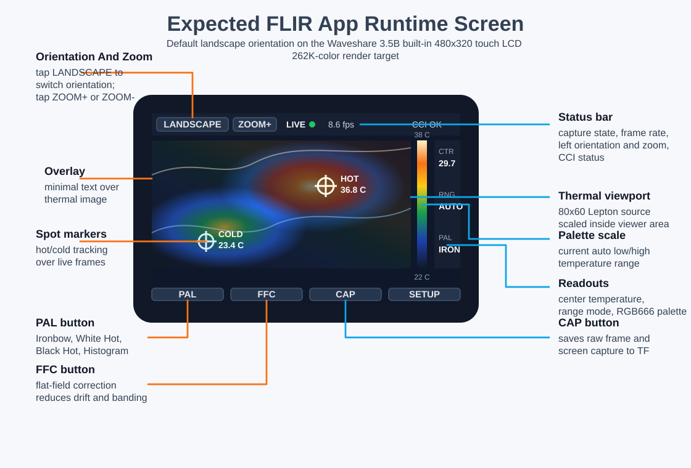
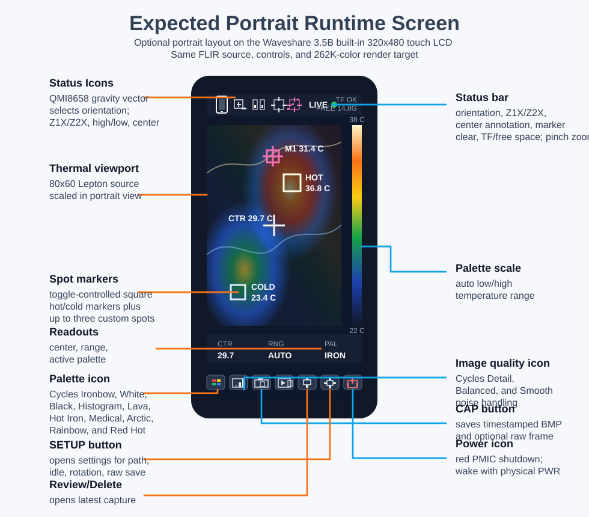

# FLIR App Design

This document is the target design for the full Waveshare
ESP32-S3-Touch-LCD-3.5B FLIR application. The current firmware scaffold is a
bring-up build that initializes Serial, FLIR CCI/I2C, and FLIR VoSPI pins; the
full capture/render/storage app described here is the next implementation stage.

## Expected Runtime UI

### Landscape Default



### Portrait Optional



The first complete app screen should prioritize a live thermal viewport with
only the controls and readouts needed during use: frame status, hot/cold markers,
center temperature, palette/range state, manual FFC, orientation switching,
capture to TF card, and a `SETUP` placeholder for future feature/device
configuration.

Landscape is the default orientation for this hardware. The UI should include a
small `ROT` touch button that toggles between landscape and portrait layouts when
needed. The selected orientation should be saved with other viewer settings so
the device boots back into the user's last chosen layout.

The final render target is the built-in 480x320 landscape display using the
panel's 262K-color capability. Palette output should use RGB666/18-bit color
when the display driver supports it; RGB565 should only be used as a documented
fallback.

The `FFC` button triggers FLIR flat-field correction. FFC lets the Lepton
recalibrate its sensor offset against a uniform reference, usually the module's
internal shutter, which reduces fixed-pattern noise, image banding, and thermal
drift after warm-up or ambient temperature changes.

The `PAL` button cycles thermal visualization styles: Ironbow, White Hot, Black
Hot, and Histogram. Histogram mode should use the frame distribution to improve
contrast when the scene has a narrow temperature range.

## System Architecture Overview

The full firmware should be split into shared board support and real FLIR code:

- `include/pin_config.h`: board pin assignments for LCD, touch, SD, and FLIR.
- `include/display_driver.h` and `src/display_driver.cpp`: Waveshare
  ESP32-S3-Touch-LCD-3.5B built-in LCD/touch configuration.
- `src/flir/`: real Lepton acquisition, image processing, rendering, touch capture, and SD saving.
- `src/main.cpp`: initializes board support and runs the FLIR application loop.

Follow [Modular Design Principles](modular-design-principles.md): keep
`src/main.cpp` thin, route all lifecycle orchestration through `Application`, and
add future devices as independent driver modules with explicit interfaces.

The LCD, touch controller, backlight, and TF card are built into the Waveshare
board. The firmware should use the 3.5B board support definitions for display,
touch, and storage.

The onboard TF-card path is still a shared-resource concern. SD writes should
happen outside the tight Lepton capture window and should not block the capture
task.

The connected camera is a FLIR Lepton 2.5 on breakout board v1.4. It uses a
separate SPI bus for VoSPI so the high-rate thermal stream does not contend with
LCD rendering:

```text
FLIR CLK/SCLK GPIO38
FLIR MOSI GPIO40
FLIR MISO GPIO39
FLIR CS   GPIO41
CCI SDA   GPIO8
CCI SCL   GPIO7
PWR_EN    not connected on breakout v1.4
RST       not connected on breakout v1.4
```

On many Lepton breakout boards, the pin labeled `CLK` is the VoSPI/SPI clock.
Wire that `CLK` pin to `GPIO38`. Do not confuse it with `SCL`: `SCL` is the
I2C/CCI control clock and should go to `GPIO7`. `SDA` is the I2C/CCI data line
and should go to `GPIO8`.

For this build, wire FLIR `MOSI` to `GPIO40` as a required Lepton SPI signal.
The firmware initializes the dedicated FLIR SPI bus with SCLK, MISO, MOSI, and
CS so the breakout wiring matches the configured bus exactly.

Avoid wiring Lepton VoSPI to `GPIO1` through `GPIO6` or `GPIO12` because those
pins are already used by the built-in LCD path on this board. Also avoid
`GPIO9`, `GPIO10`, and `GPIO11` for FLIR if onboard TF-card support is enabled.

The current code implements VoSPI frame reads. CCI control over I2C is reserved by pin map and can be added later for telemetry mode, FFC, and camera configuration.
Because breakout v1.4 does not expose dedicated power-enable or reset pins, the
firmware leaves `FLIR_POWER_ENABLE` and `FLIR_RESET` disabled in
`include/pin_config.h`.

## Data Pipeline Flowchart

```text
Lepton VoSPI packets
        |
        v
LeptonDriver::readFrame()
  - reads 60 packets
  - rejects discard packets
  - detects packet order loss
  - resyncs on timeout/sync loss
        |
        v
raw 14-bit frame, 80x60 uint16_t
        |
        +--> ImageProcessor::calculateSpotTemperatures()
        |     - min raw / max raw
        |     - center pixel raw
        |     - Celsius conversion
        |
        v
ImageProcessor::automaticGainControl()
  - finds min/max raw values
  - normalizes 14-bit values to 0-255
        |
        v
8-bit frame, 80x60 uint8_t
        |
        v
ImageProcessor::upscaleBilinear()
  - interpolates 80x60 into the selected landscape or portrait viewport
        |
        v
8-bit display frame, viewport-sized uint8_t
        |
        +--> CaptureStorage::saveCapture()
        |     - writes raw 14-bit .raw
        |     - writes 8-bit grayscale .bmp
        |
        v
ImageProcessor::applyPalette()
  - Ironbow
  - White Hot
  - Black Hot
  - Histogram
  - selectable at runtime with Serial command "p"
        |
        v
RGB666/262K-color render buffer, viewport-sized
        |
        v
Display::pushImage()
        |
        v
Waveshare 3.5B LCD with min/max/center overlay
```

## Build Modes

Real FLIR mode is now the project default:

```bash
pio run
```

Upload real FLIR mode:

```bash
pio run --target upload
```

The bring-up firmware is selected by the default environment:

```bash
pio run -e waveshare-esp32-s3-touch-lcd-35b-flir
```

In real FLIR mode, the Serial Monitor accepts:

```text
p  cycle palette: Ironbow -> White Hot -> Black Hot -> Histogram
r  rotate orientation: landscape -> portrait -> landscape
```

## API Reference

### `ImageProcessor::automaticGainControl`

```cpp
bool automaticGainControl(const uint16_t* raw14,
                          size_t pixelCount,
                          uint8_t* out8,
                          uint16_t* minRaw = nullptr,
                          uint16_t* maxRaw = nullptr) const;
```

Normalizes a raw 14-bit radiometric frame into an 8-bit image. It scans the input to find the frame minimum and maximum, then maps the range linearly to `0..255`.

- `raw14`: input array of 14-bit Lepton values stored in `uint16_t`.
- `pixelCount`: number of pixels to process.
- `out8`: output 8-bit normalized buffer.
- `minRaw`: optional output for minimum raw value.
- `maxRaw`: optional output for maximum raw value.
- Returns `true` on success, `false` for invalid buffers.

### `ImageProcessor::upscaleBilinear`

```cpp
bool upscaleBilinear(const uint8_t* src,
                     uint16_t srcWidth,
                     uint16_t srcHeight,
                     uint8_t* dst,
                     uint16_t dstWidth,
                     uint16_t dstHeight) const;
```

Upscales an 8-bit thermal image using bilinear interpolation. The real FLIR app
calls this with `80x60` input and a viewport sized for the active layout. The
default active layout is landscape on the 480x320 built-in LCD.

- `src`: normalized source image.
- `srcWidth`: source width in pixels.
- `srcHeight`: source height in pixels.
- `dst`: destination buffer.
- `dstWidth`: output width in pixels.
- `dstHeight`: output height in pixels.
- Returns `true` on success, `false` for invalid dimensions or buffers.

### `ImageProcessor::applyPalette`

```cpp
void applyPalette(const uint8_t* normalized,
                  size_t pixelCount,
                  DisplayPixel* colorOut,
                  PaletteMode palette) const;
```

Converts 8-bit intensity values to palette-colored pixels for the LCD. The
preferred display pixel format is RGB666/18-bit so the 262K-color panel is used
properly. If the selected Waveshare display driver only accepts RGB565 buffers,
perform that conversion in the display layer and keep the palette source at
higher precision.

- `normalized`: input 8-bit image.
- `pixelCount`: number of pixels.
- `colorOut`: output color buffer for `pushImage`.
- `palette`: `PaletteMode::Ironbow`, `PaletteMode::WhiteHot`,
  `PaletteMode::BlackHot`, or `PaletteMode::Histogram`.

### `ImageProcessor::calculateSpotTemperatures`

```cpp
SpotTemperatures calculateSpotTemperatures(const uint16_t* raw14,
                                           uint16_t width,
                                           uint16_t height) const;
```

Calculates minimum, maximum, and center-pixel temperatures. Raw Lepton values are converted using `C = raw * 0.01 - 273.15`, which matches radiometric Kelvin centi-degree output.

### `LeptonDriver::readFrame`

```cpp
LeptonStatus readFrame(uint16_t* raw14, size_t pixelCount);
```

Reads one 80x60 Lepton frame over VoSPI.

- Returns `LeptonStatus::Ok` on success.
- Returns `Timeout` if a full frame is not received within the frame window.
- Returns `SyncLost` if discard packets or packet ordering indicate VoSPI sync loss.
- Returns `SpiError` for invalid buffers.

### `CaptureStorage::saveCapture`

```cpp
bool saveCapture(const uint16_t* raw14,
                 size_t rawPixelCount,
                 const uint8_t* bitmap8,
                 uint16_t bitmapWidth,
                 uint16_t bitmapHeight);
```

Saves two files to `/flir` on the SD card:

- `frame_00001.raw`: raw radiometric 14-bit values stored as little-endian `uint16_t`.
- `frame_00001.bmp`: 8-bit grayscale BMP generated from the processed display buffer.

Returns `true` only if both files are written successfully.

## Touch Capture Behavior

The app attaches an interrupt to `TOUCH_IRQ`. The ISR only sets a `volatile` flag. The main loop consumes that flag with debounce logic, so SD writes and display updates never run inside interrupt context.

When tapped:

1. The current frame is paused.
2. The raw 14-bit frame and 8-bit BMP are written to SD.
3. The frozen frame remains on screen.
4. A second tap resumes live rendering.

## Troubleshooting Guide

### VoSPI Synchronization Loss

Symptoms:

- Serial prints `Lepton sync loss`.
- Serial prints `frame timeout waiting for VoSPI packets`.
- The LCD stops updating or skips frames.

Likely causes:

- FLIR CS, SCLK, MISO, or ground is not connected correctly.
- SPI mode or clock is incompatible with the module wiring.
- The Lepton has not completed boot before reads start.
- Packet reads started mid-frame and the stream needs resync.

What the firmware does:

- Rejects discard packets where the packet ID nibble is `0x0F`.
- Verifies packet numbers arrive sequentially from `0..59`.
- Holds CS high and waits about `185ms` in `LeptonDriver::resync()`.
- Prints descriptive errors to Serial.

Suggested checks:

- Confirm `FLIR_SPI_CS`, `FLIR_SPI_SCLK`, `FLIR_SPI_MISO`, and `GND`.
- Confirm the Lepton breakout voltage requirement.
- Lower `kSpiFrequency` in `lepton_driver.h` if wiring is long or noisy.
- Add CCI initialization once the module is connected if telemetry/radiometric mode needs explicit configuration.

### SD Card Write Failures

Symptoms:

- Serial prints `SD error: failed to mount card`.
- Serial prints `unable to open ... for BMP write`.
- Capture tap pauses the display but no files appear on the card.

Likely causes:

- Board support pin configuration does not match the Waveshare 3.5B TF-card path.
- The TF card is active while display or FLIR transactions are timing-sensitive.
- Card is not formatted as FAT32.
- Shared SPI bus wiring has MISO/MOSI/SCLK swapped.
- Card cannot sustain writes or is write-protected.

What the firmware does:

- Keeps TF-card writes out of the tight Lepton capture path.
- Creates `/flir` on mount.
- Checks file open and write errors for both `.raw` and `.bmp`.
- Leaves capture disabled if mount fails.

Suggested checks:

- Verify `pin_config.h` matches the Waveshare 3.5B board support package.
- Use a known-good FAT32 microSD card.
- Temporarily reduce SD SPI speed in `CaptureStorage::begin()`.
