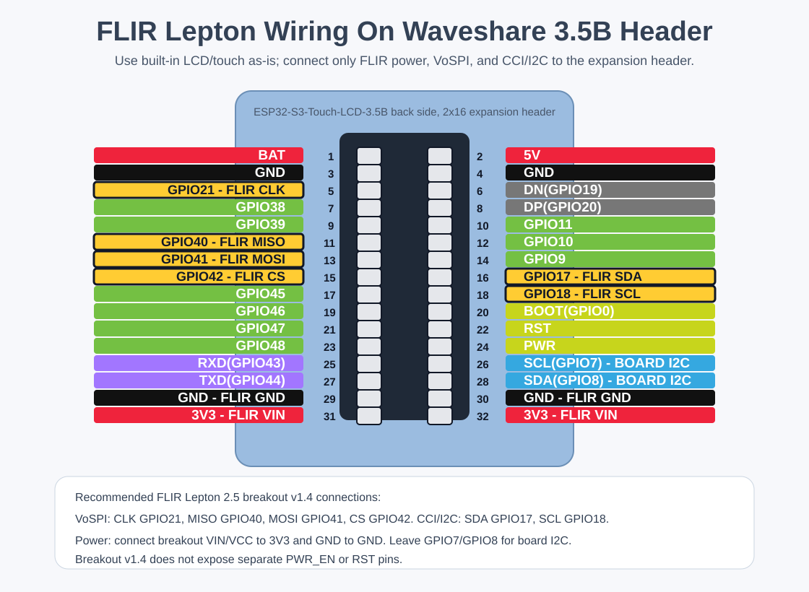

# GPIO Pin Map

This pin map is for the Waveshare ESP32-S3-Touch-LCD-3.5B board.

The important design choice remains: keep FLIR Lepton VoSPI capture on pins that
are not used by the built-in LCD/touch path. The Waveshare board already wires
LCD, touch, backlight, onboard I2C peripherals, and TF-card support, so the old
external LCD/touch GPIO map is intentionally removed.

## Board Header Placement

Use the 2x16 expansion header and/or camera FPC nets exposed by the 3.5B board.
The proposed FLIR wiring uses GPIOs that Waveshare routes to the camera/expansion
area and leaves the built-in LCD/touch GPIOs alone.

| Board area | Device signals |
|---|---|
| Built-in LCD/touch | Do not wire externally. LCD/touch/backlight are already routed on the PCB. |
| 2x16 expansion header / camera nets `GPIO38`, `GPIO39`, `GPIO40`, `GPIO41` | Dedicated FLIR VoSPI SCLK, MISO, MOSI, CS. |
| Exposed board I2C `ESP_SDA`, `ESP_SCL` | FLIR CCI/I2C SDA and SCL. |
| Power rails | Use `3V3` for the FLIR breakout and common `GND`. |

## Avoided Pins

Avoid these pins for external FLIR wiring unless the board schematic is changed:

- `GPIO0`: boot/download strapping button on many boards.
- `GPIO1`, `GPIO2`, `GPIO3`, `GPIO4`, `GPIO5`, `GPIO6`, `GPIO12`: used by the
  built-in LCD data/control/backlight path on this board.
- `GPIO45`, `GPIO46`: strapping-related pins and also routed to camera nets.
- `GPIO19`, `GPIO20`: commonly used for native USB D-/D+.
- `GPIO43`, `GPIO44`: commonly used for UART logging/programming.
- `GPIO9`, `GPIO10`, `GPIO11`: routed to the onboard TF-card/expansion SPI nets.
  Do not use them for FLIR if TF-card support is enabled.
- `GPIO7`, `GPIO8`: shared board I2C. Use them for FLIR CCI only, not VoSPI.
- Any board-specific flash/PSRAM pins.

## Proposed Bus Summary

| Function | ESP32-S3 GPIO | Notes |
|---|---:|---|
| Built-in LCD/touch | Board support pins | Use Waveshare 3.5B display/touch drivers; no external GPIO wiring. |
| Onboard TF card | Board support pins | Use Waveshare/firmware SD configuration; do not assign these pins to FLIR. |
| FLIR SPI SCLK | `GPIO38` | Dedicated Lepton VoSPI clock. Exposed as a camera/expansion net. |
| FLIR SPI MISO | `GPIO39` | Lepton VoSPI data into ESP32-S3. |
| FLIR SPI MOSI | `GPIO40` | Dedicated Lepton SPI MOSI connection. |
| FLIR SPI CS | `GPIO41` | Dedicated Lepton chip-select. |
| FLIR I2C SDA | `GPIO8` | Shared board I2C/CCI data. |
| FLIR I2C SCL | `GPIO7` | Shared board I2C/CCI clock. |

## FLIR Lepton 2.5 Breakout v1.4 Wiring

This project assumes a FLIR Lepton 2.5 on breakout board v1.4. That breakout
exposes SPI/VoSPI and I2C/CCI at 3.3V logic, but it does **not** provide
separate `PWR_EN` or `RST` pins to wire to the ESP32-S3.

Important naming note: many FLIR Lepton breakout boards label the video SPI
clock as `CLK` instead of `SCK` or `SCLK`. That `CLK` pin is **not** the same as
I2C `SCL`. Use `GPIO38` for the breakout `CLK` pin, and use `GPIO7` only for the
I2C/CCI `SCL` pin.

| FLIR breakout signal | ESP32-S3 GPIO | Direction | Notes |
|---|---:|---|---|
| VIN / VCC | 3.3V | Power | Confirm breakout voltage requirements. |
| GND | GND | Power | Common ground. |
| CLK / SPI SCK / SCLK | `GPIO38` | ESP32-S3 to FLIR | Dedicated VoSPI video clock. This is the breakout `CLK` pin. |
| SPI MISO / VoSPI data | `GPIO39` | FLIR to ESP32-S3 | Thermal packet stream. |
| SPI MOSI | `GPIO40` | ESP32-S3 to FLIR | Dedicated Lepton SPI MOSI connection. |
| SPI CS | `GPIO41` | ESP32-S3 to FLIR | Dedicated chip-select. |
| SDA / CCI SDA | `GPIO8` | Bidirectional | Shared board I2C data; verify pullups on the combined bus. |
| SCL / CCI SCL | `GPIO7` | ESP32-S3 to FLIR | Shared board I2C clock; verify pullups on the combined bus. |
| RESET / RST / EN | Not connected | - | Breakout v1.4 does not expose this pin. |
| PWR_EN | Not connected | - | Breakout v1.4 does not expose this pin. |

Quick breakout-label mapping:

| If your FLIR breakout says... | Connect to ESP32-S3 |
|---|---:|
| `VIN` / `VCC` | Header `3V3`, pin 31 or pin 32 |
| `GND` | Header `GND`, pin 29 or pin 30 |
| `CLK` | `GPIO38`, header pin 7 |
| `SCL` | `GPIO7`, header pin 26 |
| `SDA` | `GPIO8`, header pin 28 |
| `MISO` / `DATA` / `VoSPI` | `GPIO39`, header pin 9 |
| `MOSI` | `GPIO40`, header pin 11 |
| `CS` | `GPIO41`, header pin 13 |

## Alternate Pin Strategy

If the camera/expansion GPIO group is needed for another peripheral, choose a
different set only after checking the Waveshare 3.5B schematic. Keep the same
bus separation if you choose another pin group. ESP32-S3 can route SPI signals
through the GPIO matrix, but high-speed Lepton capture is sensitive to wiring
and contention. Prioritize short wiring and stable pins for:

1. FLIR `SCK`
2. FLIR `MISO`
3. FLIR `CS`
4. FLIR I2C `SDA/SCL`
